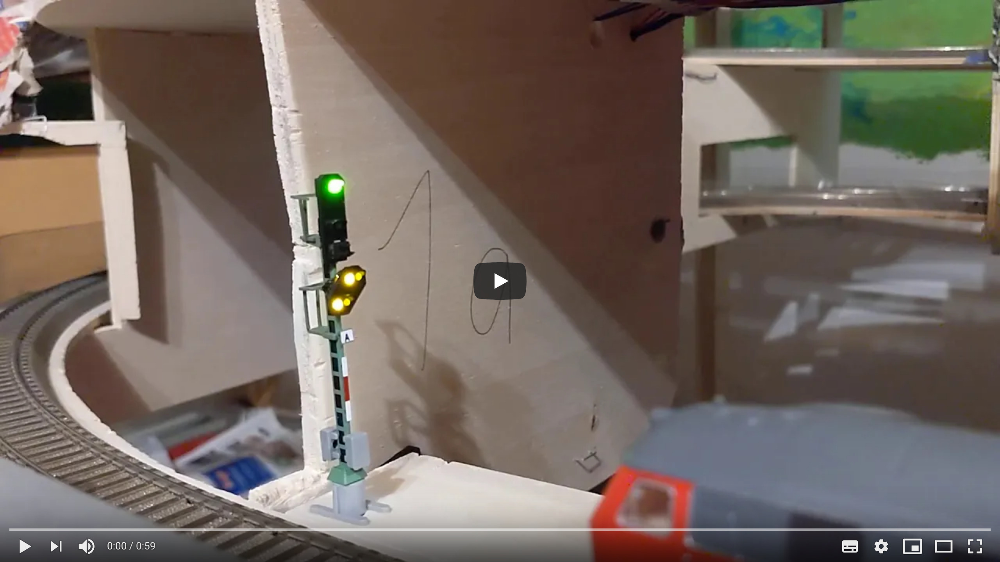
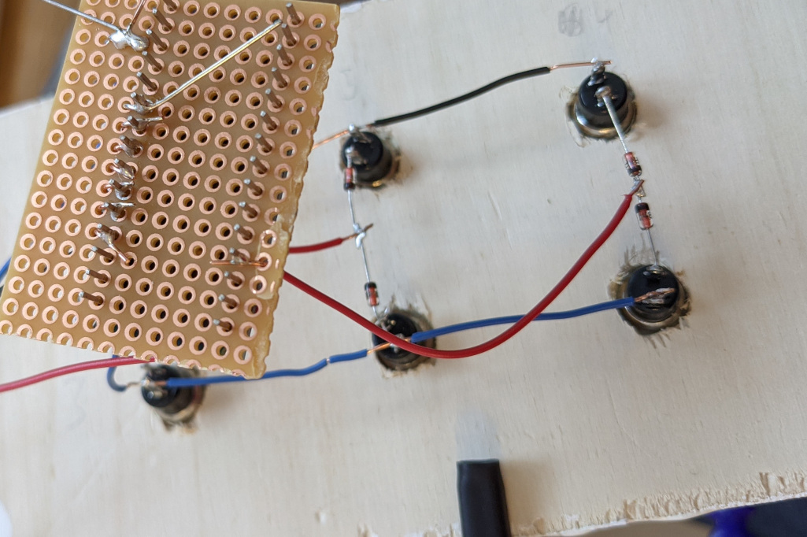

[English version](#english-version)

Ein kleiner Test f&uuml;r ein Einfahrsignal. Ich wollte Erfahrungen mit dem Arduino, mit WS2811-LEDs (erlaubt die
Ansteuerung von bis zu 256 RGB-LEDs mit nur 3 Kabeln) und Eingabematrixen sammeln, daher ist alles deutlich
&uuml;berkompliziert. Ansonsten h&auml;tte man das auch einfach alles direkt mit dem Arduino verbinden k&ouml;nnen.

Die Wiederverwendbarkeit ist wohl gering, aber vielleicht hilft es ja doch dem einen oder anderem mit einer Idee.

Da das Signal 7 LEDs hat, habe ich 3 WS2811-Bausteine ben&ouml;tigt. Jede LED kann einzeln animiert werden, hierbei
wird ein Ease Out Effekt verwendet. Am Anfang geht es also recht schnell, aber um die Zielhelligkeit zu erreichen,
dauert es etwas, das entspricht meinem Empfinden nach den Gl&uuml;hbirnen recht gut. Dazu wird einfach die
`animate`-Funktion aufgerufen, mit dem Index der gew&uuml;nschten LED, der Zielhelligkeit (0-255), der Dauer der
Animation in Millisekunden und der Startverz&ouml;gerung in Millisekunden, bis die Animation beginnt.

Das Vorsignal soll bei Hp0 ja dunkel sein, daher setze ich nur die `vorsignal` Variable und triggere dann `setVr`, dass
dann die tats&auml;chliche Animation triggert.

Eine Eingabematrix kann die Anzahl der ben&ouml;tigten Pins des Arduino sehr reduzieren. Da ich aber nur 6 Taster
hatte, lohnt es sich hier eigentlich fast gar nicht. Eine 2x3-Matrix ben&ouml;tigt 2 Ausgabepins und 3 Eingabepins.
Ich spare also einen einzigen Pin.

Eine Eingabematrix funktioniert so, dass nacheinander je eine Spalte auf Low gesetzt wird und dann alle Zeilen
abgefragt werden. Ist die Zeile auch Low, ist der Taster in dieser Spalte und Zeile gedr&uuml;ckt, ist er High, ist er
nicht gedr&uuml;ckt. Mit Dioden wird verhindert, dass bei mehreren gleichzeitig gedr&uuml;ckten Tastern falsche Tasten
ausgelesen werden. So funktionieren meines Wissens nach auch PC-Tastaturen, und bei der Menge an Tasten spart man dann
tats&auml;chlich Pins ein.

## English version

This is a small test to control a miniture railway signal with the Arduino Nano. I wanted to gain experience with the
Arduino, with WS2811 LEDs (allows controlling 256 RBG leds with just 3 cables) and input matrices. Because of this,
everything is quite overcomplicated, as the Arduino has enough pins to connect everything directly for this simple use
case.

Reuseability is probably hard, but maybe it helps someone with an idea.

I needed 3 WS2811 chips to control the 7 LEDs of the signal. Every led can be animated separately. I always use an ease
out easing function, so the animation starts quickly but then takes a while to reach the target brightness. This matches
my impression of a classic light bulb pretty well. Just call the `animate` function with the index of the led, the
target brightness (0-255), the duration of the animation in milli seconds and the start delay in milli seconds that
needs to expire before the animation starts.

If the main signal is red (Hp0), the distant signal needs to be dark. That's why I just set the `vorsignal` variable
and then trigger `setVr` which starts the actual animation.

An imput matrix can help reduce the required pins for many inputs. But I just needed 6 buttons, and a 2x3 matrix
requires 2 output pins and 3 input pins. So I saved a whole pin!

An input matrix works by setting one column to low and then query each row separately. Is the row low, the button in
that column and row was pressed, is it high, then the button is released. The diodes prevent reading ghost buttons in
case many buttons are pressend at the same time. As far as I know, PC keybords use the same principle.
